 
## 查看主页获取源码

> **作者介绍**： **✌**全网粉丝10W+本平台特邀作者、博客专家、CSDN新星计划导师、java领域优质创作者,博客之星、掘金/华为云/阿里云/InfoQ等平台优质作者、专注于毕业项目实战 **✌**

  

### 一、作品包含

源码+数据库+设计文档万字+全套环境和工具资源+部署教程

### 二、项目技术

前端技术：Html、Css、Js、Vue、Element-ui

数据库：MySQL

后端技术：Java、Spring Boot、MyBatis

  

### 三、运行环境

开发工具：IDEA

数据库：MySQL8.0

数据库管理工具：Navicat10以上版本

环境配置软件： JDK1.8+Maven3.6.3

前端Nodejs：14
  

### 四、项目介绍
项目编号：springbootA031

在线培训系统是一款基于SpringBoot+Vue开发的考试系统。一款多角色在线培训考试系统，系统集成了用户管理、角色管理、部门管理、题库管理、试题管理、试题导入导出、考试管理、在线考试、错题训练等功能，考试流程完善。

多角色：多角色支持

考试端：学生学员角色、支持在线考试、查看分数、训练错题。

管理端：题库管理、试题管理、考试管理、用户部门管理、查看考试情况等等。

定员考试：考试权限定义

完全公开：任何人员都可以参与考试。

指定部门：只有选中部门的人员才可以看到考试。

多题型：常用题型支持

支持题型：单选题、多选题、判断题。

难易程度：普通、困难。

便捷组卷：题库组卷

题库组卷：指定题库、分数、数量；题目、选项随机排序、杜绝作弊

### 五、运行截图

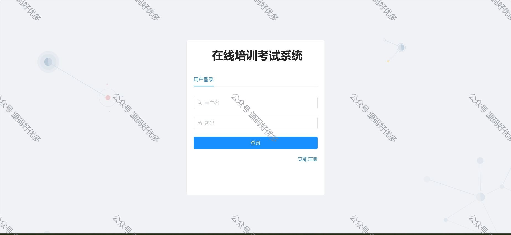
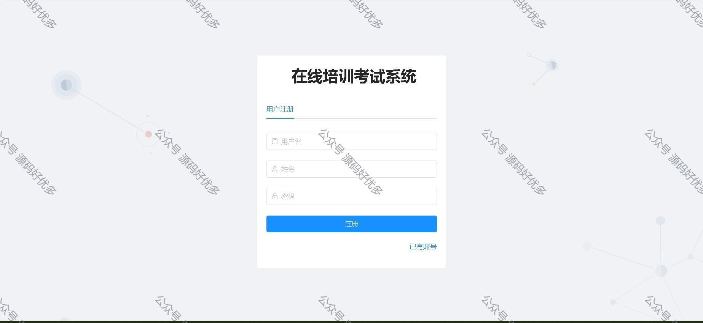
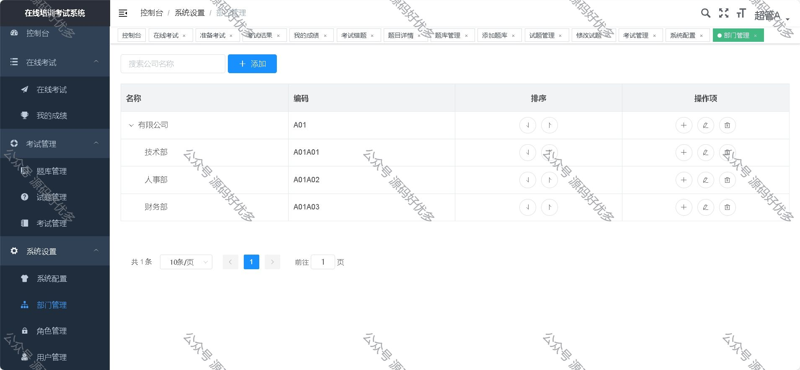
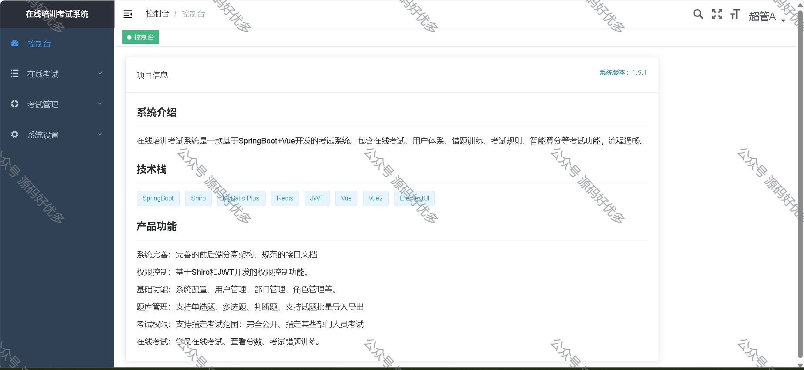
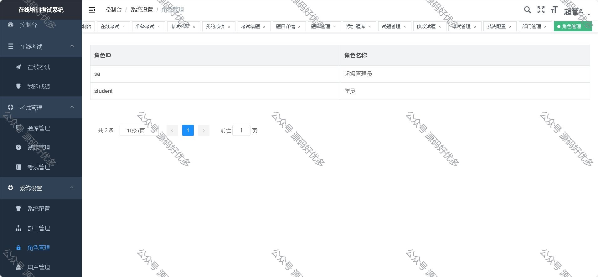
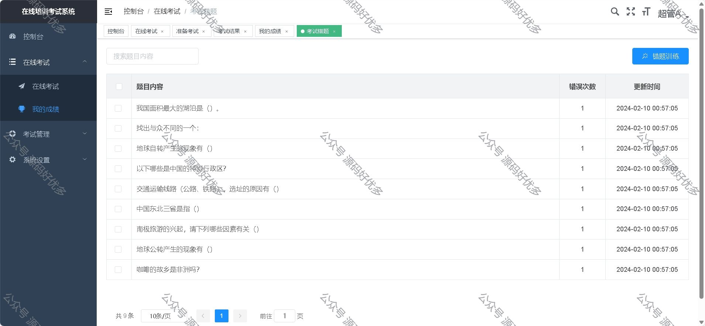
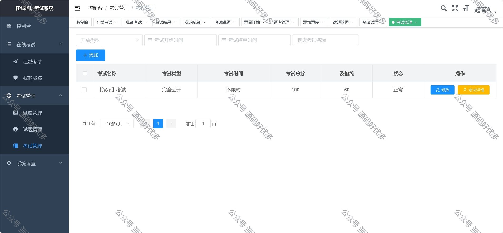
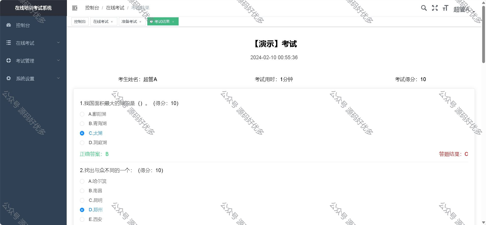
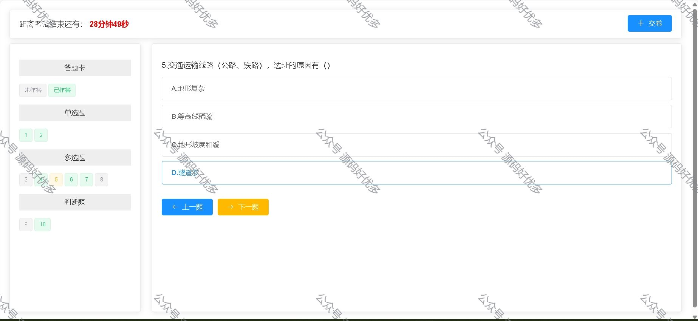
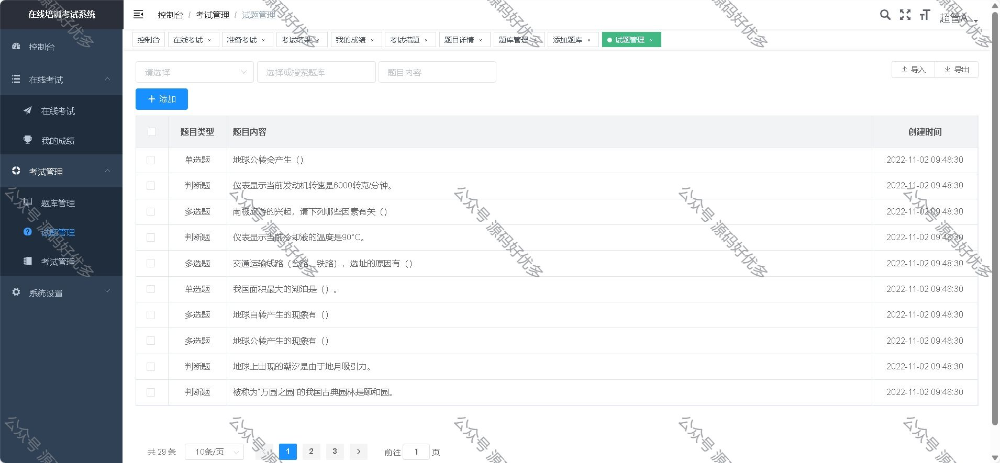
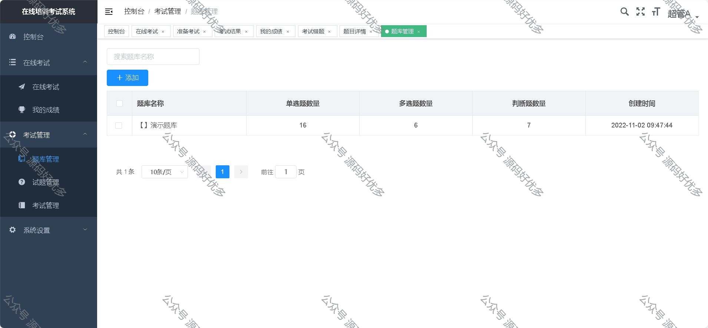
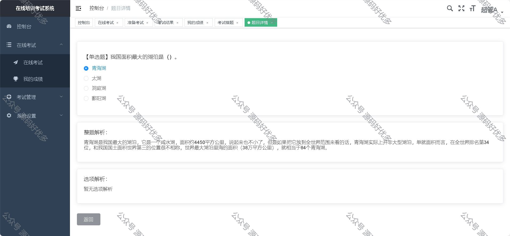

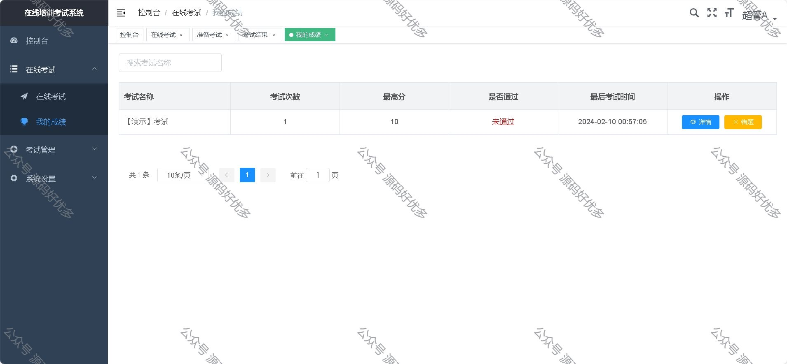
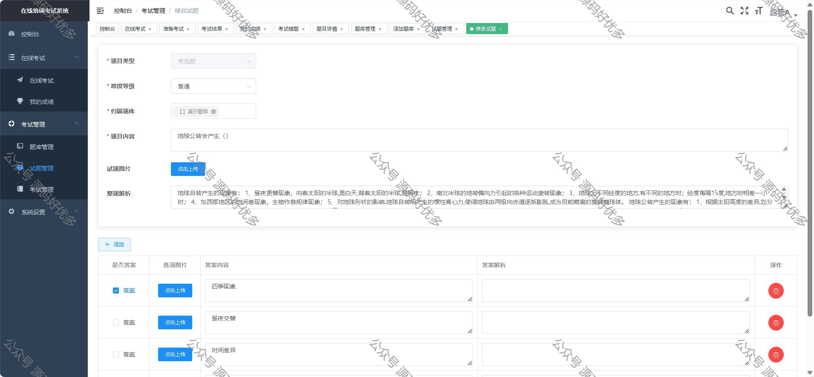
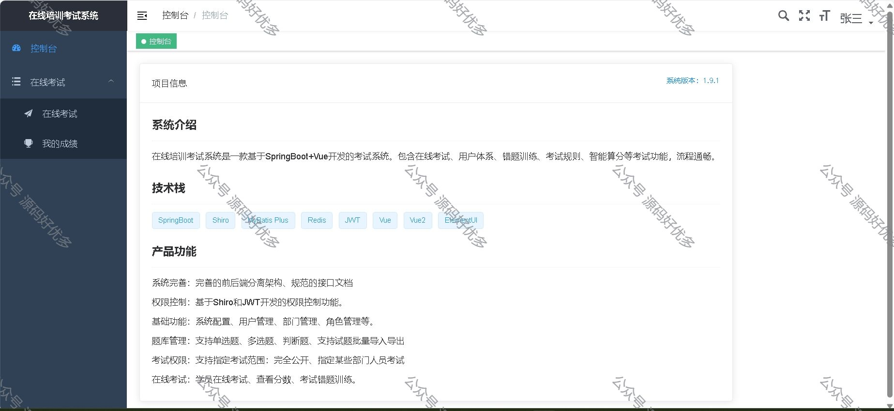
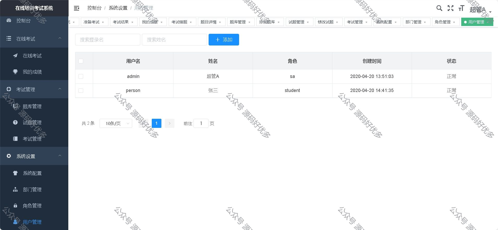
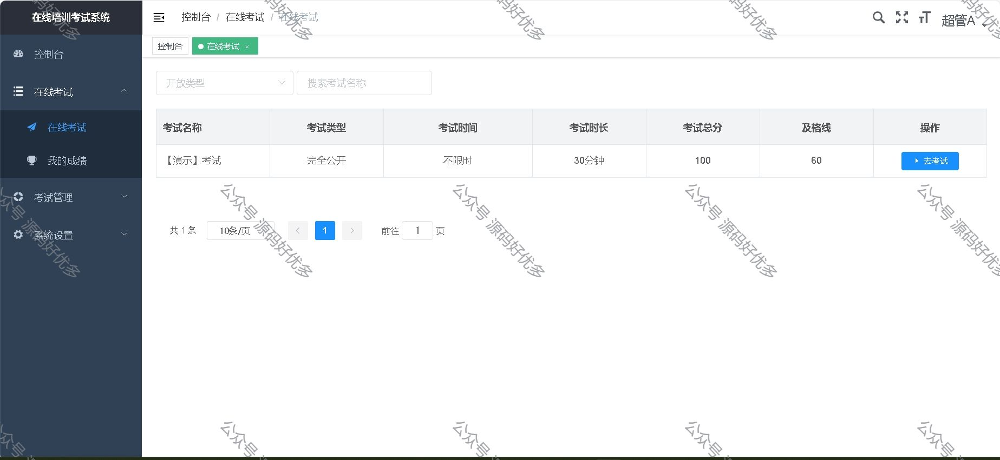
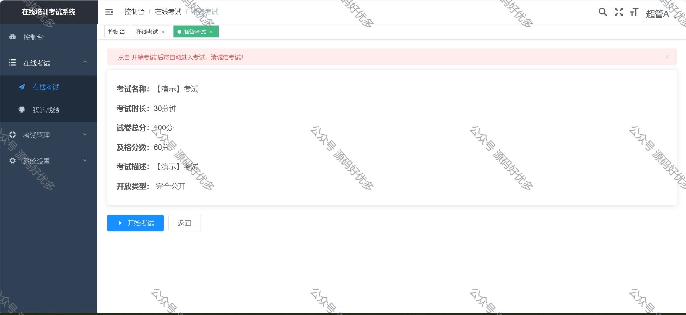

  
